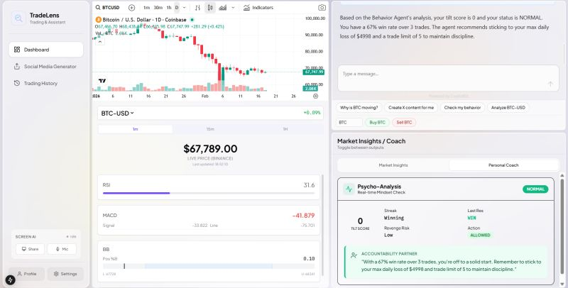
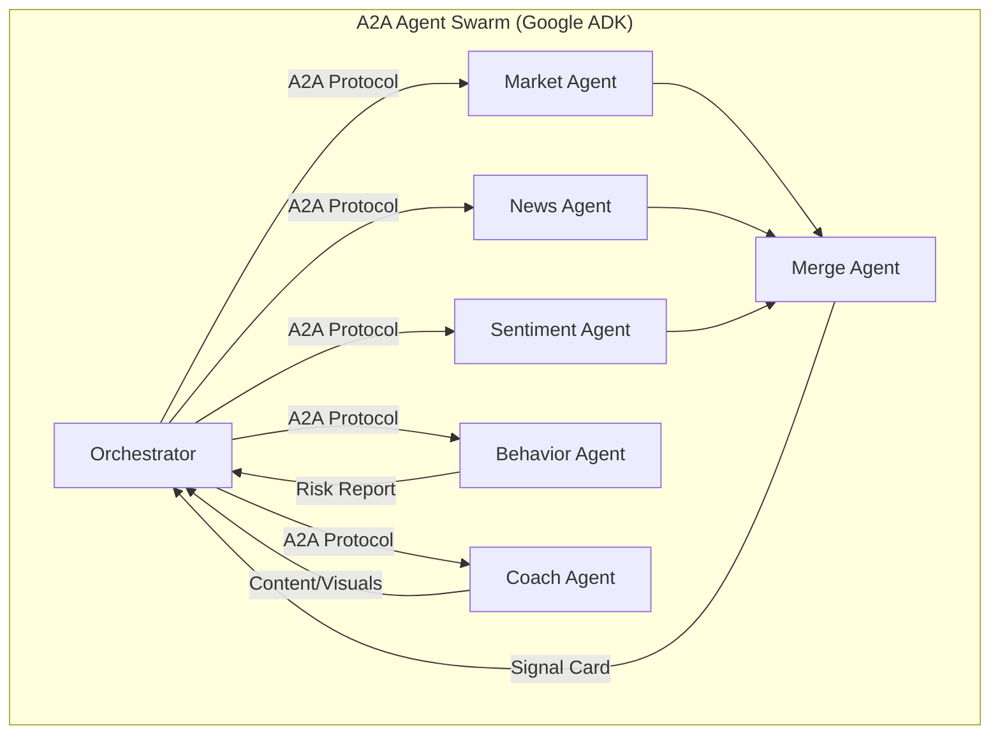

# TradeLens: Multi-Agent Trading System

A sophisticated multi-agent system for cryptocurrency trading, real-time market analysis, and AI-driven mentorship, powered by **Google ADK (Gemini)** and **A2A Protocol**.

## Web Interface


## Table of Contents
- [Features](#features)
- [Quick Start](#quick-start)
- [Architecture](#architecture)
- [Usage](#usage)
- [Project Structure](#project-structure)
- [Technologies](#technologies)
- [Troubleshooting](#troubleshooting)

## Features
- **Real-Time Indicators**: Live technical analysis (RSI, MACD, Bollinger Bands) using pseudo-real-time simulation.
- **Workflow Orchestration**: Coordination of specialized agents for complex tasks like "Synthesis" or "Trading Advice".
- **Personalized Behavior Analysis**: Detects "Tilt," loss streaks, and revenge trading risks.
- **AI Content Creation**: Generates viral market visuals with embedded data overlays (Mock/Gemini).
- **Multi-Model Support**: Utilizes Google Gemini 2.0 Flash/Pro for high-speed reasoning.

---

## Quick Start

### Prerequisites

- Node.js 18+
- Python 3.10+
- All api key in .env.example

### Setup

1. **Install Frontend Dependencies:**

```bash
rename the folder download into trading-agents
npm install
```

2. **Install Python Dependencies:**

```bash
cd agents
python -m venv .venv
# Activate the virtual environment:
# Windows:
.venv\Scripts\activate
# Mac/Linux:
source .venv/bin/activate

pip install -r requirements.txt
```

3. **Configure Environment Variables:**

```bash
cp .env.example .env
# Edit .env and add your GOOGLE_API_KEY
```

4. **Start the System:**

```bash
npm run dev
```

This command concurrently starts:
- **UI** on `http://localhost:3000`
- **Orchestrator Agent** on `http://localhost:9000`
- **Market Agent** on `http://localhost:9020`
- **News Agent** on `http://localhost:9021`
- **Sentiment Agent** on `http://localhost:9022`
- **Merge Agent** on `http://localhost:9023`
- **Behavior Agent** on `http://localhost:9025`
- **Coach Agent** on `http://localhost:9026`

---

## Usage

**Try asking:**
- *"Analyze the market for Bitcoin"* (Triggers Synthesis Workflow)
- *"Can I buy Ethereum right now?"* (Triggers Behavior Check + Advice)
- *"Create a LinkedIn post about the crypto crash"* (Triggers Content Creation)
- *"Check my behavior"* (Generates a personalized risk report)

**The Orchestrator will:**
1. Determine the intent (Analysis vs Advice vs Content).
2. Route tasks to specialized agents via A2A Protocol.
3. Synthesize results into a cohesive response or UI card.

---

## Architecture



### Specialized Agents
- **Orchestrator (Port 9000)**: The brain. Routes queries and manages conversation state.
- **Market Agent (Port 9020)**: Fetches technical indicators (RSI, price action).
- **News Agent (Port 9021)**: Scrapes potential catalysts and news headlines.
- **Sentiment Agent (Port 9022)**: Analyzes crowd psychology and social volume.
- **Merge Agent (Port 9023)**: Synthesizes data from Market, News, and Sentiment into a final "Buy/Sell" signal.
- **Behavior Agent (Port 9025)**: Analyzes user trading history for psychological risks (Tilt, FOMO).
- **Coach Agent (Port 9026)**: Provides mentorship and generates marketing content/images.

---

## Project Structure

```
trading-agents/
├── app/
│   ├── api/copilotkit/route.ts       # A2A Middleware Configuration
│   └── page.tsx                      # Main Dashboard UI
│
├── components/
│   ├── RealTimeIndicators.tsx        # Live chart/indicator simulation
│   ├── BehaviorCard.tsx              # Risk analysis visualization
│   ├── CoachCard.tsx                 # AI Content & Image display
│   ├── MarketCard.tsx                # Technical data display
│   └── [other UI components]
│
├── agents/                           # Python Agent Source Code
│   ├── orchestrator.py               # Main Orchestrator Logic
│   ├── market_analysis_agent.py      # Technical Analysis
│   ├── behavior_agent.py             # Psychology/Risk Analysis
│   ├── coach_agent.py                # Content & Mentorship
│   ├── merge_agent.py                # Data Synthesis
│   ├── services/                     # Helper services (Supabase, Deriv)
│   └── requirements.txt              # Python dependencies
│
└── public/                           # Static assets (Mock images, icons)
```

## Technologies

- **Frontend**: Next.js 15, CopilotKit, Tailwind CSS
- **Backend**: Google ADK (Gemini Models), FastAPI, Uvicorn
- **Protocols**: 
  - **A2A (Agent-to-Agent)**: For inter-agent communication.
  - **AG-UI**: For bringing agent UIs to the frontend.
- **AI Models**: Gemini 2.0 Flash / Pro

## Troubleshooting

**Agents not connecting?**
Verify all services are running by checking `http://localhost:9000` through `9026` in your browser.

**Missing API keys?**
Ensure `.env` contains a valid `GOOGLE_API_KEY`.

**Python Import Errors?**
Ensure you have activated the virtual environment: 
`cd agents` -> `source .venv/bin/activate` (or `.venv\Scripts\activate` on Windows).

## License

MIT
